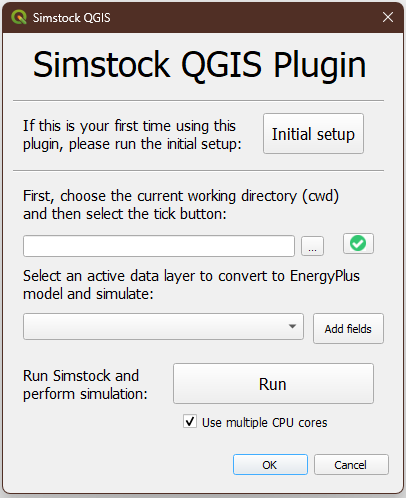
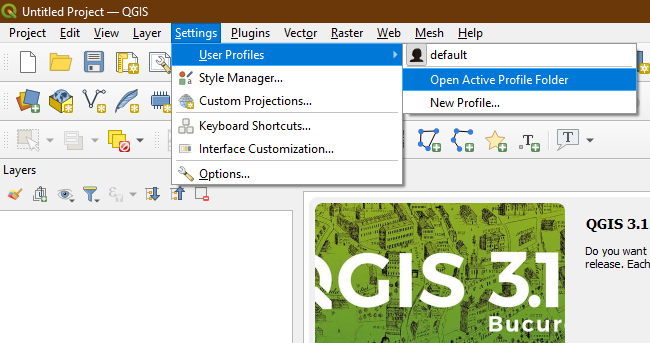

# Simstock QGIS Plugin Documentation

## Installation, setup and testing
### Supported QGIS versions
The plugin has been tested on a range of QGIS versions, on both Windows and Mac operating systems. The supported versions of QGIS are any LTR (long-term release) between QGIS LTR 3.10 and the latest QGIS LTR 3.22.

The non-LTR versions are likely to work too, however sometimes the Python versions and associated packages in these versions differ from the LTR versions.

###  Installation
  
1. Also search for `Plugin Reloader' and tick the box when it shows up.
    
2. After ticking the boxes, you will need to restart QGIS.
    
3. If the Simstock QGIS plugin has successfully been installed, you should be able to see it listed under the `Plugins' list as well as a new icon on the toolbar.

4. The plugin will now need to be tested - see the next section for information.

### Initial setup
Before running anything, make sure that the QGIS Python Console is open as there will be outputs here that will be useful to read. It should open automatically when the plugin is launched, but if not, you can do this by clicking **Plugins $\rightarrow$ Python Console** in the top bar of QGIS.

When the plugin is launched, you will see an **Initial Setup** button. This will run checks to verify that all the dependencies are working as expected.

Click the **Initial Setup** button and watch the Python console for any errors. If any of the steps fail, they should be reported here. If all checks passed, a green success message should show up in the QGIS console. The plugin should now be fully functioning - though you may need to restart QGIS for a final time.

## Using the plugin
### Important notes
There are some important things to note when using the plugin:
* **Python Console**: When using the plugin, always have the Python console open. This will output information about what the plugin is doing. It should open by default when the plugin is launched, but if not, you can do this by clicking Plugins $\rightarrow$ Python Console in the top bar of QGIS.
* **Python Errors**: If an error occurs, a yellow notification appears in QGIS. The Python error can be viewed by clicking 'Stack Trace'. This should give information about what is causing the error.
* **Plugin Reloader**: Make sure the Plugin Reloader is installed (see Section~\ref{section:installation}). If the Simstock plugin stops functioning correctly, reload it using the plugin reloader.

### The interface

The Simstock QGIS plugin UI

### Input data
Before the plugin is run, the input data must be prepared in such a way that Simstock can process it.

#### Geometry
The geometry (i.e. buildings footprints) must exist as a Vector Layer. There are no requirements about where this geometry is sourced from; it can be hand-drawn or acquired from a digital source. %The plugin retrieves the geometry directly from the selected layer's feature geometries using the built-in QGIS Python API.

#### Attribute table fields
The input data for each polygon is specified via the QGIS attribute table. Simstock expects certain fields to exist here. These fields can be added to the Vector Layer by selecting the layer in the drop-down menu and clicking on the **Add Fields** button. This will add the following fields to the layer:

* '**UID**' - Unique identifier [string]
    * The UIDs for each polygon are automatically generated by the plugin when the `Add Fields' button is pressed. The UIDs should NOT be changed. An ID that is unique to each polygon.% This is used by Simstock to name and identify zones and objects in the EnergyPlus model which belong to the given polygon. It is also used to retrieve the simulation results.

* '**height**' - Building height (m) [float]
  * Expressed in metres.

* '**shading**' [boolean string]
  * FALSE - Building is included in the energy modelling.
  * TRUE - Building is treated as a shading block. In this case, the only other attributes required for the given polygon are the UID and building height.

* '**wwr**' - Window-to-wall/glazing ratio (%) [float]
  * The ratio between the surface area of the window to the surface area of the wall for the building. Expressed as a percentage value between 0-100.

* '**nofloors**' - Number of floors [integer]
  * Number of floors in the building. Determines how many thermal zones are stacked vertically within the EnergyPlus model for the given polygon.

* '**construction**' [string]
  * Used to select a construction preset from the database - explained further in TODO.

* '**glazing_const**' [string]
  * Used to select a glazing construction preset from the database.

* '**ventilation_rate**' [float]
  * Specifies the ventilation rate in 'air changes per hour' (ACH). Applies to every zone in the building

* '**overhang_depth**' - Shading overhang depth (m) [float]
  * Allows a shading overhang to be added to each window. If left blank or at '0' value, no overhangs are created. If a float value is specified, an overhang will be added to every window of the polygon with a depth of the specified amount in metres (m).
    

# TODO:
* Add remaining documentation sections
* Update documentation to latest plugin version
* Replace any LATEX syntax
* Insert images

